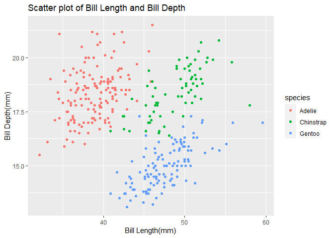

p8105_hw1_zj2357
================
Zekai Jin
2022-09-19

First of all, we should include the libraries we are using and prepare
the dataset.

``` r
library(tidyverse)
data("penguins", package = "palmerpenguins")
penguins = na.omit(penguins)
```

# Problem 1

The penguins dataset consists with 8 columns and 333 rows. The heading
of the dataset is as follows.

    ## # A tibble: 6 × 8
    ##   species island    bill_length_mm bill_depth_mm flipper_l…¹ body_…² sex    year
    ##   <fct>   <fct>              <dbl>         <dbl>       <int>   <int> <fct> <int>
    ## 1 Adelie  Torgersen           39.1          18.7         181    3750 male   2007
    ## 2 Adelie  Torgersen           39.5          17.4         186    3800 fema…  2007
    ## 3 Adelie  Torgersen           40.3          18           195    3250 fema…  2007
    ## 4 Adelie  Torgersen           36.7          19.3         193    3450 fema…  2007
    ## 5 Adelie  Torgersen           39.3          20.6         190    3650 male   2007
    ## 6 Adelie  Torgersen           38.9          17.8         181    3625 fema…  2007
    ## # … with abbreviated variable names ¹​flipper_length_mm, ²​body_mass_g

The columns are *species, island, bill_length_mm, bill_depth_mm,
flipper_length_mm, body_mass_g, sex, year*. Among these columns, the
mean flipper length is 200.97.

We then make a scatter plot between Bill Length and Bill Depth, finding
that Bill Height positively correlates with Bill Depth, and the
relationship varies between species.

``` r
penguins_scatter = ggplot(penguins,aes(x = bill_length_mm, y = bill_depth_mm,color = species)) +
  geom_point() + 
  labs(x = "Bill Length(mm)", y = "Bill Depth(mm)") +
  ggtitle("Scatter plot of Bill Length and Bill Depth")

penguins_scatter
```

<!-- -->

``` r
ggsave('plots/penguins_scatter.pdf',plot = penguins_scatter,width = 5,height = 3)
```

# Problem 2

Generating required data frame with tibble.

``` r
p2_df = tibble(normal = rnorm(10),
             logical = normal > 0,
             character = as.vector(sample(1:10,10),mode = "character"),
             factor = factor(sample(1:3,10,replace = TRUE),levels = c(1,2,3)))
```

Try taking the means of the dataframe.

``` r
for (coln in colnames(p2_df)) {
  print(paste("printing column:",coln))
  print(mean(pull(p2_df,var = coln)))
  }
```

    ## [1] "printing column: normal"
    ## [1] 0.4429325
    ## [1] "printing column: logical"
    ## [1] 0.8
    ## [1] "printing column: character"
    ## [1] NA
    ## [1] "printing column: factor"
    ## [1] NA

Thus, meanapplies to numerical and logical datatypes, but not to
character and factor datatypes.

``` r
for (coln in colnames(p2_df[2:4])) {
  print(as.numeric(pull(p2_df,var = coln)))
  }
```

    ##  [1] 1 0 1 1 0 1 1 1 1 1
    ##  [1]  8  9  4  5  2 10  6  1  3  7
    ##  [1] 2 2 2 1 2 1 1 2 3 2

When converting to numeric data types, logical data is converted to 0/1,
characters are converted to numbers or NAs if not possible and factors
are converted to their levels. Although it is possible to use
`as.numeric` to enable `mean()` function for factor datatype, it is
dangerous in most cases.
